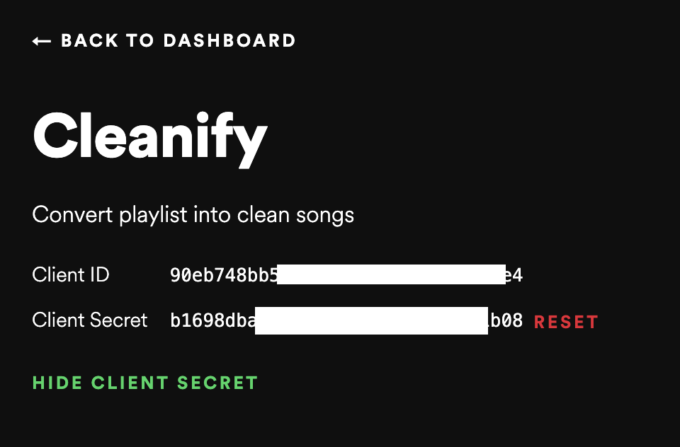
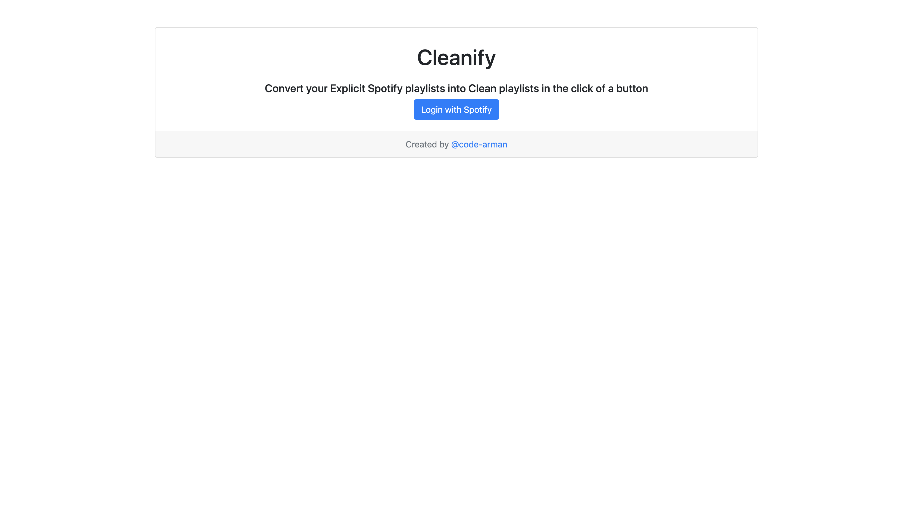

# Cleanify

### What it does:

Cleanify converts your Explicit spotify playlists into Clean spotify playlists so you can listen to your favorite playlists when your parents are around!

### How to run it:

1. Login to your [Spotify Developer Dashboard](https://developer.spotify.com/dashboard/applications)
2. Create a "new app" and record your Client ID and Client Secret
3. Go to "edit settings" within your project and set the Redirect URI to http://localhost:3000/callback and save
4. Clone this github repo or download the zip file. This example saves it to your desktop

```
cd Desktop
git clone https://github.com/code-arman/Cleanify.git
cd Cleanify
```

5. Once you're in the project directory in Terminal, run the following npm command (make sure you already have [Node](https://nodejs.org/en/download/) installed)

```
npm install
```

6. Add your Client ID and Client Secret that you got from your Spotify developer dashboard into terminal by running the following commands. Replace your information wtih YOURCLIENTID and YOURCLIENTSECRET.



```
export CLIENT_ID=YOURCLIENTID
export CLIENT_SECRET=YOURCLIENTSECRET
```

7. Run the following commands
   ```
   cd src
   node server.js
   ```
8. Go to `http://localhost:3000/` in your browser (preferably Google Chrome)
9. Login with Spotify and Cleanify your Playlists
10. Your new playlist will show up in your spotify account

### How it works:

Cleanify sends a request to spotify's api for each song in the selected playlist with " clean" appended at the end. Often times, users have created a playlist with the Clean version of that song inside of it, so it shows at the top of the search results. Cleanify then compares each song in this recenetly searched for playlist to the song that the user has in their own playlist, and adds it to a new 'Cleanified' playlist if it is both non-explicit and has the same name. There is no method to ensure all songs in the playlist have a clean version, but using Cleanify gives you the best chance at finding the clean version if it is there, and removes it if it can't find the clean version of the song. This will make it so when you want to listen to your playlist around your parents, the songs will not have swear words :)

## How to use it

<h6>Login Screen</h6>



<h6>Cleanify Screen</h6>


